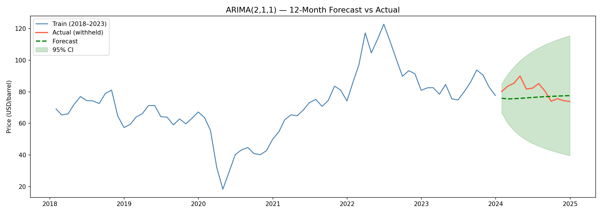
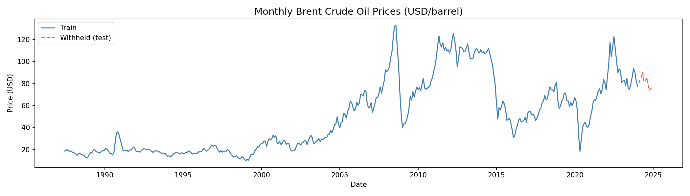
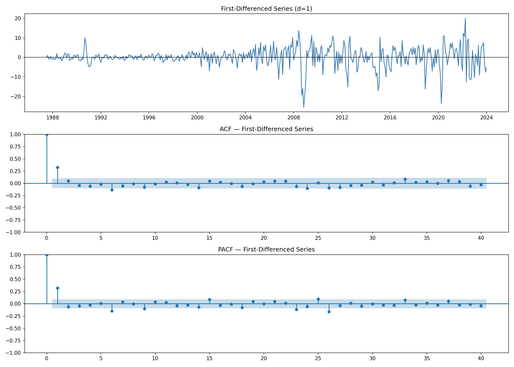
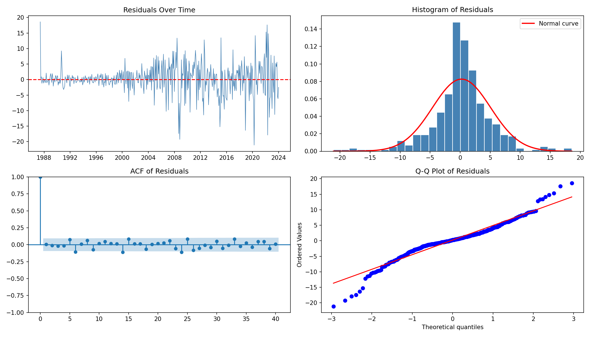

# 🛢️ Oil Price Forecasting with ARIMA
### Time Series Analysis of Monthly Brent Crude Oil Prices (1987–2024)

[](https://python.org)
[](https://www.statsmodels.org)
[](https://pandas.pydata.org)
[](https://scikit-learn.org)
[](LICENSE)

---

## Overview

This project applies the **Box-Jenkins ARIMA methodology** to model and forecast monthly Brent Crude Oil prices sourced from the [FRED database](https://fred.stlouisfed.org/series/DCOILBRENTEU). The analysis covers nearly four decades of data (May 1987 – December 2023), encompassing major market disruptions including the 2008 financial crisis, the 2014–2016 oil glut, and the COVID-19 demand collapse.

The goal is to determine whether historical price dynamics alone can produce reliable short-term forecasts — and to be honest about where a linear model fails.

---

## Results at a Glance

| Metric | Value |
|--------|-------|
| Final Model | **ARIMA(2, 1, 1)** |
| Training Observations | 440 months (1987–2023) |
| Forecast Horizon | 12 months (2024) |
| MAE | **5.92 USD/barrel** |
| RMSE | **6.85 USD/barrel** |
| MAPE | **7.15%** |

> The model successfully tracked the general 2024 price level (~$75–77/barrel). The April 2024 spike to ~$90 (driven by Middle East tensions) was not captured — as expected from any linear model.



---

## Methodology

The project follows the classical **Box-Jenkins pipeline**:

```
Raw Data → Stationarity Check → Differencing → ACF/PACF Analysis
    → Candidate Model Comparison (AIC/BIC) → Residual Diagnostics → Forecasting
```

### 1. Stationarity
The Augmented Dickey-Fuller (ADF) test confirmed the original series is non-stationary (p = 0.39). After first-order differencing, stationarity was achieved (p ≈ 0.000), establishing **d = 1**.

### 2. Model Identification
ACF and PACF plots of the differenced series indicated:
- Significant spike at lag 1 in ACF → **MA(1)** component
- Cutoff after lag 1–2 in PACF → **AR(1) or AR(2)** component

Five candidate models were evaluated:

| Model | AIC | BIC |
|-------|-----|-----|
| **ARIMA(2,1,1)** | **2622.74** | **2639.08** |
| ARIMA(1,1,0) | 2625.34 | 2633.51 |
| ARIMA(0,1,1) | 2626.08 | 2634.25 |
| ARIMA(1,1,1) | 2626.13 | 2638.39 |
| ARIMA(1,1,2) | 2627.69 | 2644.03 |

**ARIMA(2,1,1)** was selected based on lowest AIC. All coefficients are statistically significant (p < 0.001).

### 3. Diagnostics
| Check | Result |
|-------|--------|
| Ljung-Box (lag 10) | p = 0.27 → no autocorrelation ✅ |
| Ljung-Box (lag 20) | p = 0.22 → no autocorrelation ✅ |
| ACF of residuals | All lags within 95% CI ✅ |
| Normality | Heavy tails present ⚠️ (expected for commodity data) |

**Known limitation:** Residuals exhibit leptokurtosis (fat tails) due to extreme price shocks. A natural extension would be a **GARCH model** to capture time-varying volatility.

---

## Project Structure

```
oil-price-forecasting-arima/
│
├── time_series_final.ipynb   # Main analysis notebook (Google Colab)
├── README.md
│
└── figures/                  # Generated plots
    ├── ts_plot.png           # Full time series with train/test split
    ├── acf_pacf.png          # ACF & PACF of differenced series
    ├── diagnostics.png       # Residual diagnostic plots
    └── forecast.png          # 12-month forecast vs actuals
```

---

## Quickstart

### Run on Google Colab *(recommended)*
Click the badge below — no setup required:

[](https://colab.research.google.com/github/YOUR_USERNAME/oil-price-forecasting-arima/blob/main/time_series_final.ipynb)

> Replace `YOUR_USERNAME` with your GitHub username after uploading.

### Run Locally

```bash
git clone https://github.com/YOUR_USERNAME/oil-price-forecasting-arima.git
cd oil-price-forecasting-arima
pip install pandas numpy matplotlib statsmodels scipy scikit-learn
jupyter notebook time_series_final.ipynb
```

**Data is fetched automatically** from FRED on notebook run — no manual download needed.

---

## Key Visualizations

### Time Series with Train/Test Split
> Full price history from 1987–2024. The red dashed segment is the withheld test set.



### ACF & PACF of Differenced Series
> Used to identify the AR and MA orders. Clear cutoff at lag 1 in both plots guided the ARIMA(2,1,1) selection.



### Residual Diagnostics (2×2)
> Residuals over time, histogram vs normal curve, ACF of residuals, and Q-Q plot. Confirms white-noise residuals with noted heavy tails.



### 12-Month Forecast vs Actuals
> Green dashed line = ARIMA forecast. Red = actual 2024 prices. Green shaded region = 95% confidence interval.


---

## Limitations & Future Work

| Limitation | Potential Fix |
|-----------|---------------|
| Heavy-tailed residuals | ARIMA-GARCH hybrid model |
| Flat long-horizon forecasts | VAR model with exogenous variables (OPEC output, USD index) |
| Linear structure | LSTM or Temporal Fusion Transformer for nonlinear dynamics |
| Single variable | Add macro features: inflation, global demand indices |

---

## Data Source

- **Series:** Brent Crude Oil, Last Day, FOB (DCOILBRENTEU)
- **Provider:** U.S. Energy Information Administration via [FRED](https://fred.stlouisfed.org/series/DCOILBRENTEU)
- **Frequency:** Daily → resampled to monthly mean
- **Coverage:** May 1987 – December 2023 (training)

---

## References

- Box, G.E.P., Jenkins, G.M., Reinsel, G.C., & Ljung, G.M. (2015). *Time Series Analysis: Forecasting and Control* (5th ed.). Wiley.
- Hyndman, R.J., & Athanasopoulos, G. (2021). *Forecasting: Principles and Practice* (3rd ed.). OTexts. [otexts.com/fpp3](https://otexts.com/fpp3/)
- Seabold, S., & Perktold, J. (2010). statsmodels: Econometric and statistical modeling with Python. *Proceedings of the 9th Python in Science Conference*.

---

## Author

**Ala Eddine**
Machine Learning Engineer in Progress

---

*This project is part of a personal portfolio demonstrating applied time series analysis. Feedback and suggestions are welcome via Issues.*
